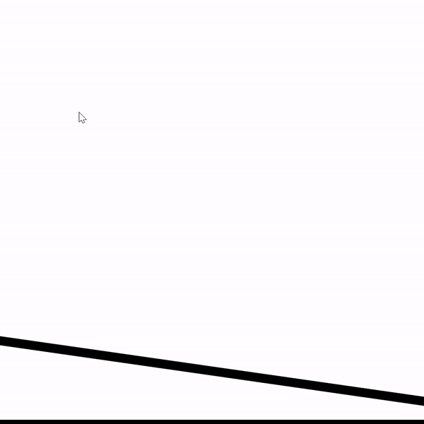

<!-- # Interactive Animation Design with Processing -->
This page collects my visual design showcases. I use [Processing](https://processing.org/) (Java mode) to create all the interactive animations presented here. These works are proof of concepts developed for [laputamega](https://www.laputamega.com), a Chinese game design company. 

- Cartoon 
> Animated cartoon figures using [Box2D](https://box2d.org/), a 2D physics engine.  In the animation, the motion of figures is simulated as in the physical world. Figures interact with each other based on gravity, collision and forces applied by users.
>  - [Mr Squishy](pages/blob.html): Squishy Blobs with big eyes can jump and squeeze each other (click to see the full video)
  <!--  -->

- Painting
> Classic paintings interweaved with motion, powered by particle systems.
>  - [Misty Landscape](pages/landscape.html) Landscape that has dense misty flows of green and blue colors 

>  - [Flowing Starry Night](pages/starrynight.html) Starry Night with floating liquid sparkles flowing across the sky

- Typography
> Rendering text with artistic visual effects.
  - [Text Fade In & Out](pages/textfadein.html)

